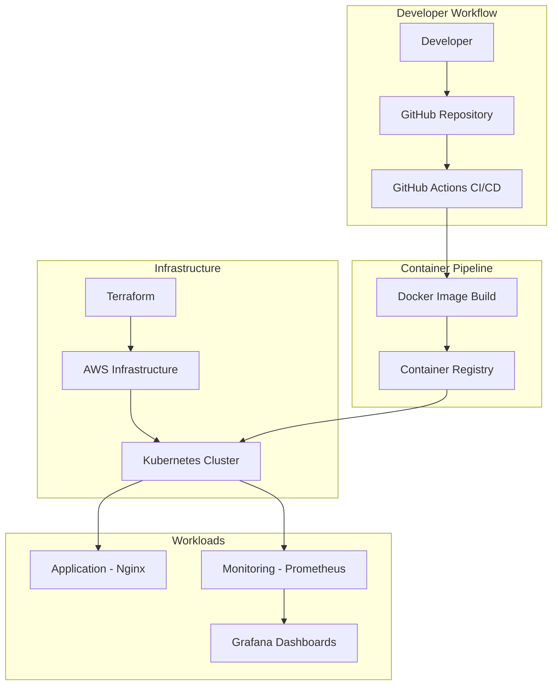

# DevOps Production Platform Architecture

```mermaid
flowchart TB

subgraph Developer Workflow
A[Developer]
B[GitHub Repository]
C[GitHub Actions CI/CD]
end

subgraph Container Pipeline
D[Docker Image Build]
E[Container Registry]
end

subgraph Infrastructure
F[Terraform]
G[AWS Infrastructure]
H[Kubernetes Cluster]
end

subgraph Workloads
I[Application - Nginx]
J[Monitoring - Prometheus]
K[Grafana Dashboards]
end

A --> B
B --> C
C --> D
D --> E

F --> G
G --> H

E --> H

H --> I
H --> J
J --> K
```
